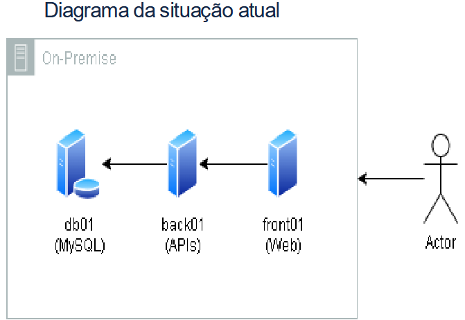
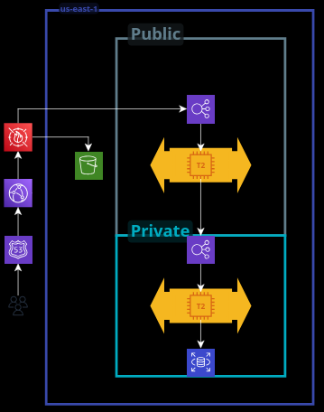
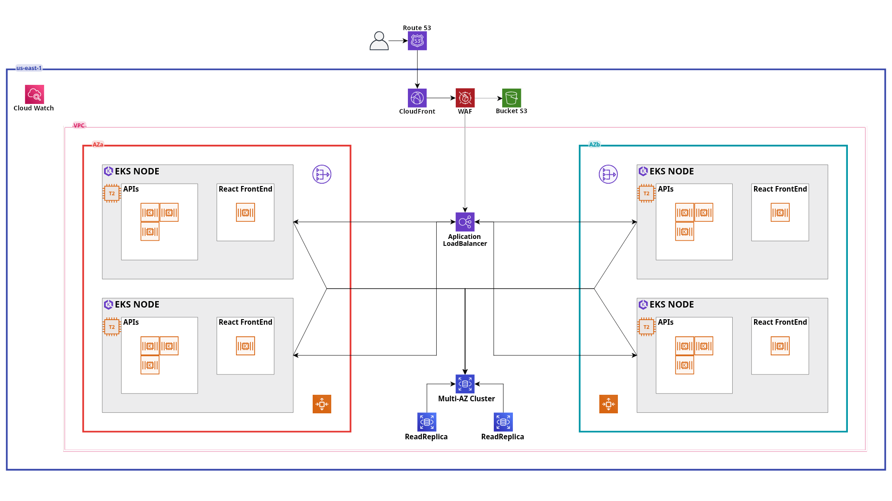

# MIGRATION OVERVIEW

Aqui será descrito o processo de migração da infraestrutura atual para a AWS, mantendo o máximo de compatibilidade e disponibilidade dos serviços durante a transição. 
Dentro deste, terá a versão resumida do que foi feito e selecionado para solucionar e construir a arquitetura do projeto, tendo links  adicionados para versão completa de cada etapa.

> Esta documentação contém links de acesso rápido para facilitar a navegação e garantir um acesso completo ao conteúdo. Sempre que precisar de mais detalhes, basta seguir os links indicados ao longo do texto 💡

---

## Estrutura Atual

Arquitetura de operação utilizada pelo cliente

- **Banco de Dados:** Servidor MySQL (500GB de dados, 10GB de RAM, 3 Core CPU).
- **Frontend:** Servidor React (5GB de dados, 2GB de RAM, 1 Core CPU).
- **Backend:** Servidor com 3 APIs, Nginx como balanceador de carga e armazenamento de arquivos estáticos (5GB de dados, 4GB de RAM, 2 Core CPU).

## Estruturas Propostas na AWS

Arquitetura Inicial As-Is:

Arquitetura Modernização Kubernetes:

A migração inicial será feita com mínimas alterações, utilizando os seguintes serviços AWS:

- **Banco de Dados:** Amazon RDS MySQL Multi-AZ.
- **Frontend:** EC2 + Load Balancer.
- **Backend:** EC2 + Load Balancer.
- **Armazenamento de Arquivos:** Amazon S3.
- **Segurança:** AWS IAM, AWS WAF e Grupos de Segurança AWS.

## Etapas da Migração

### Migração do Banco de Dados com AWS DMS

Utilizaremos o **AWS Database Migration Service (AWS DMS)** para transferir os dados do MySQL local para o **Amazon RDS MySQL Multi-AZ**.

### Passos:

1. Criar uma instância de replicação do AWS DMS antes de configurar os endpoints.
2. Criar um **Endpoint de Origem** no AWS DMS apontando para o banco MySQL atual.
3. Criar um **Endpoint de Destino** para o novo banco no Amazon RDS.
4. Configurar uma **Tarefa de Migração** com opção de **Full Load + CDC** (Change Data Capture) para replicação contínua.
5. Iniciar a migração e monitorar no **AWS DMS Console**.
6. Validar a integridade dos dados e realizar o switch para o novo banco.

🔗 [Migração do Banco de Dados (MySQL) com AWS DMS](migration_bd.md) 
___

### Migração dos Servidores com AWS MGN

Utilizaremos o **AWS Application Migration Service (AWS MGN)** para migrar os servidores **frontend** e **backend** para **instâncias EC2** na AWS.

### Passos:

1. Instalar o **AWS MGN Agent** nos servidores on-premises.
2. Configurar a **Replicação Contínua** no console do AWS MGN.
3. Criar instâncias **EC2 de teste** para validar a migração.
4. Configurar o **AWS Load Balancer** para balanceamento de carga entre as instâncias.
5. Redirecionar o tráfego para os novos servidores AWS e desligar os antigos.

🔗 [Migração dos Servidores (Frontend e Backend) com AWS MGN](migration_ec2.md) 

___

### Armazenamento de Arquivos Estáticos no Amazon S3

Os arquivos estáticos serão movidos para o **Amazon S3** para melhorar desempenho e reduzir custos de infraestrutura.

### Passos:

1. Criar um **bucket S3** para armazenar os arquivos.
2. Configurar permissões adequadas com **AWS IAM e AWS WAF**.
3. Atualizar a configuração do **Nginx** para servir os arquivos do **S3**.
4. Implementar **AWS CloudFront** para caching e melhoria de performance.

🔗 [Armazenamento de Arquivos Estáticos no Amazon S3](static_arm.md) 

___

### Segurança e Configurações Adicionais

Para garantir a segurança do ambiente na AWS, utilizaremos:

- **AWS IAM** para controle de permissões e acesso.
- **AWS WAF** para proteção contra ataques como SQL Injection e XSS.
- **Security Groups** para restringir acessos às instâncias EC2.
- **AWS CloudTrail**: Ative o CloudTrail para registrar e monitorar todas as chamadas de API feitas em sua conta. Isso permite auditar a atividade do usuário e detectar ações suspeitas.
- **AWS Key Management Service (KMS)**: Utilize o KMS para gerenciar chaves de criptografia de forma segura, protegendo dados sensíveis armazenados em S3, RDS, EBS, e outros serviços.

🔗 [Segurança do Sistema](../security_aws.md) 

---

## Navegação

### 🚀 Modernização
- [Kubernetes Moderno](../../doc/modern/modern_k8s.md)
- [Setup e Técnicas](../../doc/modern/step_tecnicas.md)

### 🔄 Migração
- [Visão Geral](../../doc/migration/migration_overview.md)
- [Migração de Banco de Dados](../../doc/migration/migration_bd.md)
- [Migração para EC2](../../doc/migration/migration_ec2.md)
- [Migração de Arquitetura Estática para ARM](../../doc/migration/static_arm.md)

### 🔒 Segurança
- [Segurança na AWS](../../doc/security_aws.md)

### ❓ FAQ
- [Perguntas Frequentes](../../doc/faq.md)
- [Fluxo de Funcionamento](../../doc/flow.md)

### 📚 Documentação Completa
- [Ver Documento Completo](../../doc/full_doc.md)
